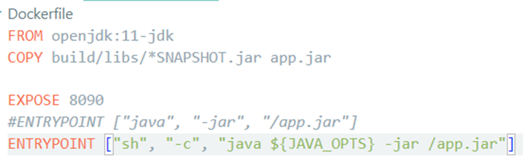
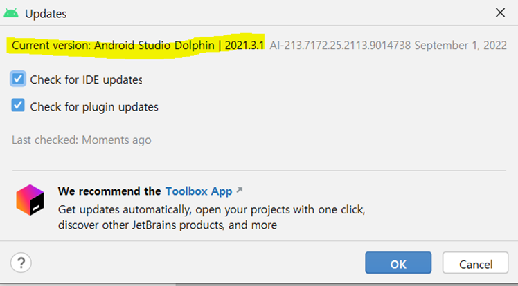
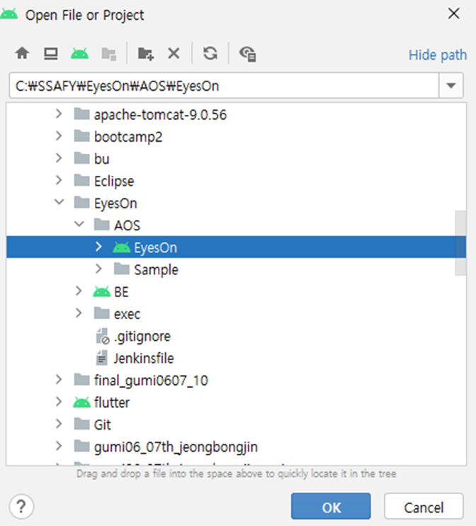
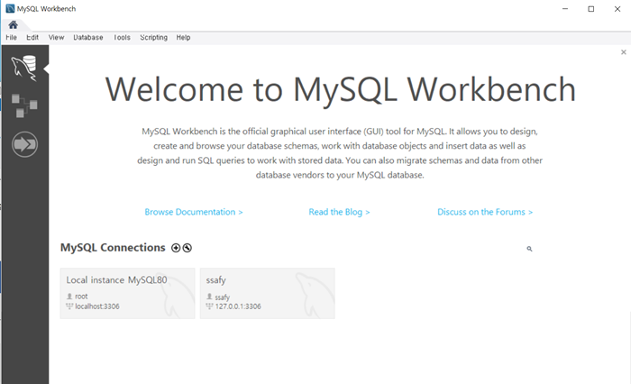
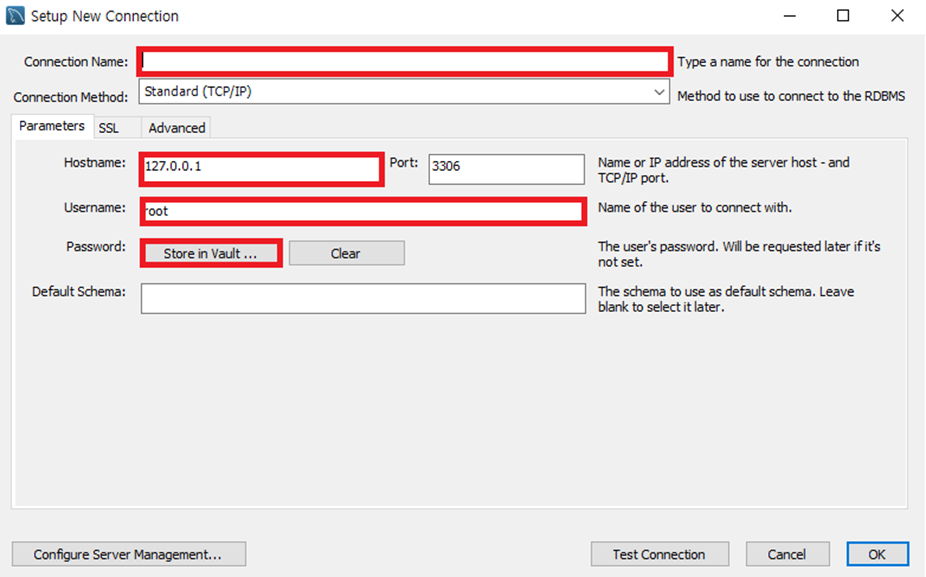
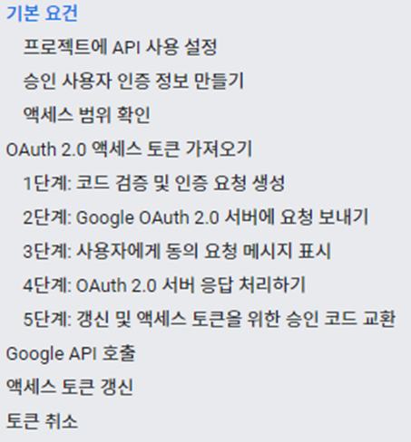
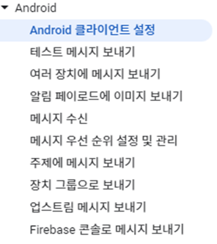
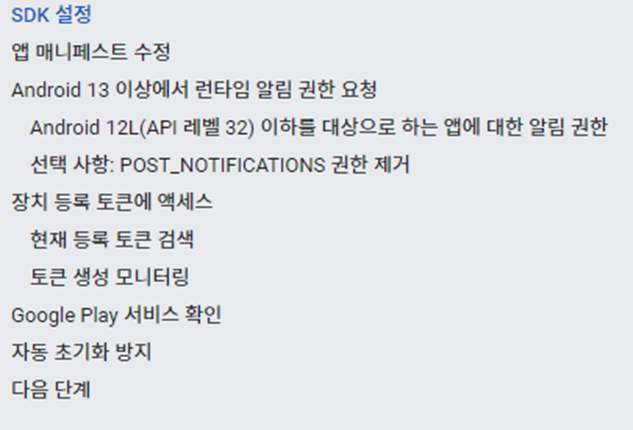

# README.md

## Eyeon

시각장애 및 저시력자를 위한 보조서비스.

## **프로젝트 소개**

> 스마트폰을 활용하여 보행 중 위험과 생활 속 불편함을 조금이라도 해소할 수 있도록 도움을 주기 위한 애플리케이션 입니다.

글자 인식, 사물 인식, 장애물 인식, 도움 요청, 민원 처리의 기능이 있습니다.
시각장애인을 도와주는 엔젤 용 애플리케이션이 존재합니다.

## 프로젝트 기술 스택

**형상관리**
- Git

**커뮤니케이션**
- Mattermost, Webex, notion

**개발환경**
- OS: Window 10, 11
- IDE
    - IntelliJ
    - Android Studio
    - UI/UX: Figma
- Database 
    - Server: AWS RDS
    - DBMS: MySQL 8.0.31
- Server: AWS EC2 
    - OS: Ubuntu 20.04 LTS (GNU/Linux 5.4.0-1018-aws x86_64)
    - SSH: MobaXterm
- File Server: AWS S3
- GPU Server: JupyterHub(SSAFY)
    - OS: Ubuntu 20.04 LTS (Linux 5.4.0-124-generic x86_64)
    - CPU: Intel Xeon Gold 6248
    - GPU: 10 X Nvidia Tesla V100 32GB
- CI/CD: Jenkins, Docker, Nginx

**상세 기술**
 
- Frontend (Android)
    - Android Studio Dolphin | 2021.3.1
    - Kotlin 1.7.20
    - JDK 11.0.13
    - Gradle 7.5
    - SDK ( Min / Target / Compile - 24 / 33 / 33 )
    - WebRTC 1.0.32
    - Retrofit 2.9.0
    - Tensorflow-lite 2.9.0
    - AR Core 1.34
    - ML Kit 18.5
    - Dagger Hilt 2.44
    - WebRTC 1.0.32006
    - Firebase Cloud Messaging 23.1
    - Room 2.4.3
    - Paging 3.1.1

- Backend
    - JDK: 11
    - Spring Boot: 2.7.5
    - Gradle 7.5
    - Spring Security
    - Spring Data JPA
    - Springfox Swagger UI: 2.9.2
    - Jasypt
    - Lombok
    - Logger
    - Json Web Token
    - GSON
    - AWS
    - Naver Cloud Api

- Server 
    - AWS EC2
    - AWS S3
    - Ubuntu 20.04 LTS
    - Docker
    - Jenkins
    - CertBot
- IDE 	
    - HeidiSQL 12.1.0
    - WorkBench 8.0CE
    - Android Studio Dolphin | 2021.3.1
    - IntelliJ IDEA | 2022.1.4
    - Spring Tool Suite 3.9.14

- AI
    - Python 3.7.12
    - Tensorflow(GPU) 2.8.0
    - CudaToolkit: 11.3.1
    - CuDNN 8.4.1.50
    - Tensorflow-lite : 2.9.0
    - JupyterHub
    - Anaconda3

## 빌드 상세 내용

**백엔드**
- Dockerfile ( ~/BE/Dokerfile )

    - Jasypt 암호 입력을 위한 변수 추가

- Jenkinsfile  ( ~/Jenkinsfile )


**프론트엔드**
   
카메라, 마이크 권한을 사용하기 때문에 에뮬레이터가 아닌 휴대폰에서 사용해야 한다.
에뮬레이터를 사용할 경우, 빌드가 되더라도 앱이 강제 종료되며 기능들을 테스트할 수 없다.
빌드 과정은 다음과 같다.

1. Android Studio 설치 혹은 버전 확인 – Dolphin (2021.3.1)
```
Android Studio 버전 확인을 원할 경우,
Help – Check for Updates – 오른쪽 아래 팝업의 Update 파란색 글씨 클릭 – Configure 버튼 누르면 버전 확인 가능
```
   
예:   


2. Kotlin 버전 확인 (N-1.7.20인지 확인)
```
File – Settings – Languages & Frameworks – Kotlin 클릭.
Current Kotlin plugin version 확인.
```

3. 프로젝트 열기
```
File – Open 탭 클릭 후,
AOS 폴더 안, Sonmal(안드로이드 아이콘) 클릭 후에 OK 버튼 클릭.
```
   


4. 프로젝트의 Gradle Version 확인
```
File – Project Structure 탭 클릭.
Project 탭에서 Gradle Version이 맞는지 확인. (Gradle Version : 7.5)
```

5. Gradle JDK 확인
```
File – Settings – Build, Execution, Deployment – Build Tools – Gradle 클릭 후,
Gradle JDK가 version 11.0.13으로 되어 있는지 확인
```

6.	휴대폰과 Android Studio 연결을 위해, 휴대폰 개발자 모드 켜서 USB 디버깅 허용 시키기
   
   휴대폰마다 방법이 다르므로, ‘휴대폰 기종 + 개발자 모드’를 검색 키워드로 검색해, 개발자 모드를 활성화 하고 USB 디버깅을 허용시켜준다.   
   예시 링크 : https://learnandcreate.tistory.com/796

7.	아래와 같이 휴대폰 연결을 확인하고, 초록색 play 버튼 클릭.
   
   

8.	Build 성공 시, 휴대폰에 앱 첫번째 화면이 나오면서 설치를 확인할 수 있다!


## 서버 세팅

**HTTPS 설정**
- 미리 도메인 등록&연결 해놓거나, SSAFY EC2 도메인 사용. 80포트는 열려 있어야 함

1) 80포트 열기
```
sudo ufw allow 80
sudo ufw status
```
2) Certbot 설치
```
sudo apt-get update
sudo snap install core; sudo snap refresh core
sudo snap install –classic certbot
sudo ln -s /snap/bin/certbot /usr/bin/certbot
```
3) Nginx 설치
```
sudo apt install nginx
```
4) Certbot 인증키 발급
```
sudo certbot –nginx –d [발급받은_도메인주소]
```
5) nginx 설정
```
cd /etc/nginx/sites-available
sudo nano default
```


6) nginx 시작
```
sudo nginx
```

**젠킨스 컨테이너 세팅**
1)	Docker 설치
```
sudo apt-get install apt-transport-https ca-certificates curl gnupg-agent software-properties-common
curl –fsSL https://download.docker.com/linux/ubuntu/gpg | sudo apt-key add –
sudo add-apt-repository \ "deb [arch=amd64] https://download.docker.com/linux/ubuntu \ $(lsb_release -cs) \ stable"
sudo apt-get update && sudo apt-get install docker-ce docker-ce-cli containerd.io
```
2)	젠킨스 설치 및 Docker volume연결
```
sudo docker run -d --name jenkins -u root --privileged \ -p '8080:8080' \ -v '/home/ubuntu/docker-volume/jenkins:/var/jenkins_home' \ -v '/var/run/docker.sock:/var/run/docker.sock' \ -v '/usr/bin/docker:/usr/bin/docker' \ jenkins/jenkins
```
3) 젠킨스 접속
```
- 설정한 포트로 젠킨스 접속
- 초기 비밀번호 : sudo cat /var/lib/jenkins/secrets/initialAdminPassword 
```
4) 젠킨스 설정 
```
- 플러그인 설치 (Gitlab, SSH)
- 새로운 아이템 추가 > Pipeline
	- 빌드 유발 : Gitlab webhook – 고급 – Secret Token에 깃랩 리포지토리에서 발급한 token 추가
		- Definition을 Pipeline script from SCM 선택
- RepositoryURL , Credential에 Gitlab ID/PW 입력
		- Branches to build= */Backend로 지정
		- Script Path = Jenkinsfile 
```
5) 서버 로그
```
sudo docker ps –a
sudo docker logs –f [backimg docker container id]
```
- 젠킨스로 빌드시 프로젝트 경로는 /home/ubuntu/docker-volume/jenkins/workspace/EyesOn/BE

**MySQL 세팅**

1)	docker pull mysql
2)	docker run --name mysql -e MYSQL_ROOT_PASSWORD=<password> -e TZ=Asia/Seoul -p 3121:3306 mysql:latest 
3)	sudo ufw allow 3121
4)	docker ps -a
5)	docker exec -it <container-id> /bin/bash
6)	mysql -u root -p <password>
7)	mysql> use mysql;
8)	mysql> update user set user=’admin-id’ where user=’root’;
9)	mysql> flush privileges;

**OpenVidu 세팅**
1)	Docker, Docker Compose 설치
2)	Openvidu 설치
```
sudo su
cd /opt
curl https://s3-eu-west-1.amazonaws.com/aws.openvidu.io/install_openvidu_latest.sh | bash
```
3)	OpenVidu 환경 설정
```
cd openvidu
nano .env
```
```
DOMAIN_OR_PUBLIC_IP=서버 도메인 
OPENVIDU_SECRET=암호 
CERTIFICATE_TYPE=letsencrypt 
HTTPS_PORT=443
```
4)	Docker 설정
```
nano docker-compose.yml
```
```
SERVER_SSL_ENABLED=true
```
5)	OpenVidu 시작
```
./openvidu start
```

## DB 계정

**MySQL 원격 접속**   

   
- Workbench를 실행합니다.
- MySQL Connection을 추가하기 위해 (+) 버튼을 클릭합니다.

**Connection 설정**
   
- Connection Name: eyeson
- Hostname: d201.kro.kr:3121
- Username: admin-jbj
- Password: hy1221

## 외부서비스

**Google OAuth**   
https://developers.google.com/identity/protocols/oauth2/native-app   


**Firebase Cloud Messaging**   
https://firebase.google.com/docs/cloud-messaging/android/client   
   




